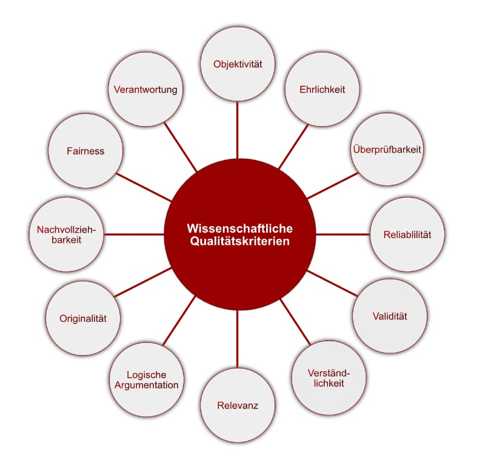
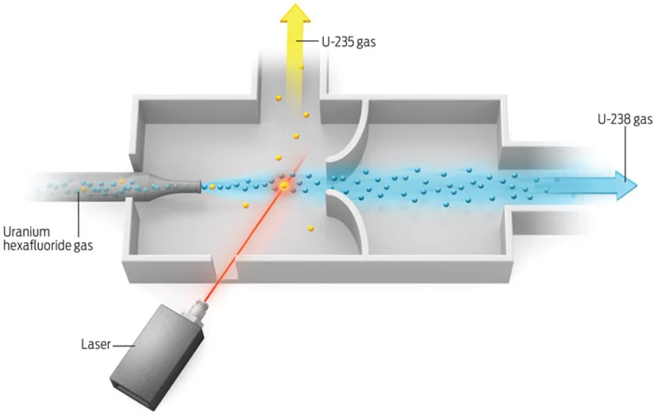
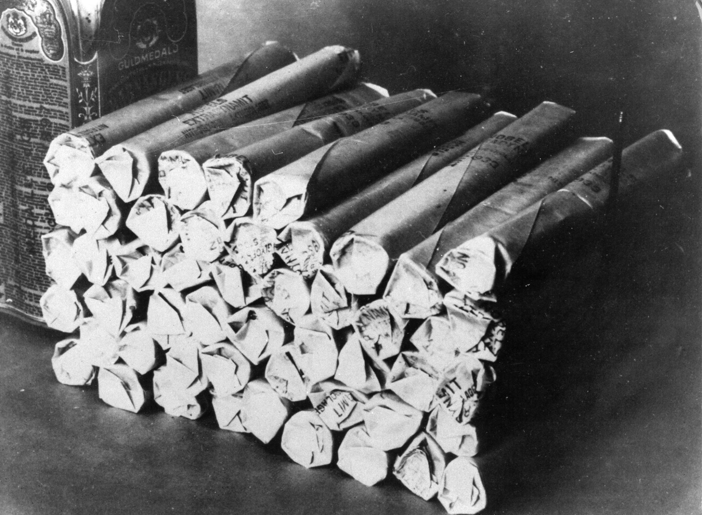

# NWP-Nachhaltigkeit-Qualität-Ethik

Mayerhuber | Schlager | Stenz

---
## Inhalt
- Nachhaltigkeit (Ausarbeitung: Lukas Mayerhuber)
- Qualitätskritärien (Ausarbeitung: Jakob Schlager)
- Ethik u. Integrität (Ausarbeitung: Michael Stenz)

---

## Nachhaltigkeit Allgemein

- **Nachhaltigkeit** ist ein Handlungsprinzip zur Ressourcen-Nutzung, bei dem die Bewahrung der wesentlichen
  Eigenschaften, der Stabilität und der natürlichen Regenerationsfähigkeit des jeweiligen Systems im Vordergrund steht.

<!-- Nachhaltigkeit ist wenn man Resourcen so nutzt, dass sich das schnell genug wieder herstellen kann. Bzw damit es nicht zu stark beeiflusst wird -->
- **Beispiele**:
    - **Mehrweg statt PET** <!--es wird weniger Plastik verwendet und somit weniger Müll produziert -->
    - **PV-Strom** <!--Strom aus erneuerbaren Energien ist nachhaltiger als Strom aus fossilen Energieträgern -->
    - **Wiederverwendung** <!--Kleidung aus Second Hand Läden ist nachhaltiger als neue Kleidung und Fast Fashion-->

---

## Nachhaltigkeit in der Wissenschaft

- **Nachhaltigkeit** in der Wissenschaft bedeutet, dass die Forschung und Entwicklung von Technologien und Produkten so
  gestaltet wird, dass sie die Umwelt und die Gesellschaft nicht schädigt.

- **Projekte**:
    - **KuRT**
      <!--KuRT steht für Ressourceneffiziente Kreislaufwirtschaft und befassen sich mit Kunststoffrecyclingtechnologien wie Sotierlösungen, verbesserte Sammlung und Logistik und die Erhöhung der Umweltverträglichkeit der Verfahren -->
    - **SUSFERT** <!--Nachhaltige Düngemittel aus Klärschlammasche und Abfallprodukten von Bioraffinerien-->
    - **GNoME**
      <!-- Ist eine Google Ai die neue Cristal Strukturen generiert. Hat bis jetzt 2.2 neue Strukturen gefunden (380.000 sind stabil). Mensch und Computer haben insgesamt 68.000 stabile Strukturen gefunden -->

---
## Nachhaltigkeit in der Forschung
Forschung benötigt viele Resourcen
#### Raumfahrt
- 155 T flüssiges Kerosins
- 362 T flüssiger Sauerstoff

Unnötige Reisen vermeiden

---

## Qualitätskriterien des wissenschaftlichen arbeitens

---

## Objektivität

- Definition
    - Objektivität bezeichnet die Unabhängigkeit der Ergebnisse von den Personen, die bei der Ergebniserstellung
      beteiligt sind.

- So gut wie möglich:
    - persönliche Meinung vermeiden,
    - Gefühle vermeiden,
    - Voreingenommenheit vermeiden

<!--Objektivität, die folgendermaßen definiert ist:
 **Das Gütekriterium Objektivität bezeichnet die Unabhängigkeit der Ergebnisse von den Personen, die bei der Ergebniserstellung beteiligt sind.**

In der Wissenschaft bezieht sich die "Objektivität" darauf, dass Forscher versuchen, ihre persönlichen Meinungen, Gefühle und Voreingenommenheiten so weit wie möglich aus ihrer Arbeit zu vermeiden, um zu verhindern, dass diese ihre Schlussfolgerungen und Ergebnisse beeinflussen. Das bedeutet, dass wissenschaftliche Untersuchungen und Beobachtungen unabhängig von individuellen Überzeugungen oder Standpunkten der jeweiligen Forscher sein sollen.

Um das zu erreichen, verwenden Wissenschaftler strenge Methoden, klare Protokolle und versuchen, ihre Forschung so zu gestalten, dass andere unabhängige Forscher zu ähnlichen Ergebnissen gelangen könnten. Durch die Anwendung von objektiven Standards und Messungen wird versucht, eine gewisse Neutralität und Zuverlässigkeit in der wissenschaftlichen Erkenntnis zu erhalten.
-->
---

## Nachvollziehbarkeit

- Klar beschriebene methodische Vorgehensweise
- Andere müssen wissenschaftliche Aussagen nachvollziehen können
- Ermöglicht Verständnis und angemessene Bewertungen

<!--
stellt sicher, dass sich die Inhalte und Verfahren einer wissenschaftlichen Arbeit für andere Person nicht zu schwer zum verstehen sind. 
Das bedeutet, dass bei einer wissenschaftlichen Arbeit systematisch-methodisch vorgegangen werden muss.
Dabei muss die (geplante und organisierte) methodische Vorgehensweise klar
beschrieben werden, um für den Leser nachvollziehbar und überprüfbar zu sein.
Das ist wichtig, denn andere müssen auf dem gleichen Weg zu den gleichen wissenschaftlichen Aussagen kommen.
-->
---

## Verständlichkeit

- Ermöglicht Lesen, Verstehen und Überprüfen
- Inhaltliche Struktur:
    - Klarer "roter Faden"
    - Aufwerfen und zielführende Bearbeitung einer Fragestellung

<!--
    Verständlichkeit:
        Klarheit
        Präzision
        
    Inhaltliche Struktur:
        Roter Faden
        Zielgerichtete Bearbeitung
        Beantwortung am Ende der Arbeit
        Logischer Aufbau
        Vom Allgemeinen zum Speziellen

    Formale Gestaltungsvorgaben (Schriftlich z.B. Doku):
        Numerierung der Seiten
        Layout
        Deckblatt
        Inhaltsverzeichnis
        Literaturverzeichnis
        Gütekriterium "Verständlichkeit" beachten-->
---

## Überprüfbarkeit

- Essenzielles Element wissenschaftlicher Arbeit
- Begründen von Hypothesen
- Klare, wissenschaftliche Gründe für Vorgehen
- Datenangaben

<!-- 
Essenzielles Element wissenschaftlicher Arbeit
Begründen von Hypothesen 
Klare, wissenschaftliche Gründe für Vorgehen
Datenangaben
Präzise Darstellung der eigenen Ergebnisse.
Nachvollziehbare Argumentation.
Wichtigkeit der Überprüfbarkeit:
Jedes Ergebnis muss überprüfbar sein, um als wissenschaftlich zu gelten.
-->
---

## Reliabilität

- Bezieht sich auf Zuverlässigkeit und Stabilität von Messungen oder Beobachtungen
- Sichert stabile und verlässliche wissenschaftliche Daten
- Reliabel betrachtete methoden bringen Vertrauen

<!--
Bezieht sich auf Zuverlässigkeit und Stabilität von Messungen oder Beobachtungen
Sichert stabile und verlässliche wissenschaftliche Daten
Reliabel betrachtete methoden bringen Vertrauen
Vergleichbare Resultate bei wiederholten Messungen
Wesentlicher Schritt in der wissenschaftlichen Forschung
-->
---

## Validierung

- Bezieht sich darauf
    - Ob ein Experiment das misst, was es wirklich soll
- Liefert Ergebnisse
- Wenn nicht valide -> beeinträchtigt Galubwürdigkeit & Aussagekraft

<!-- 
Eine Validierung bezieht sich darauf, ob eine Methode bzw. ein Experiment das misst, was es auch wirklich messen soll. Mit anderen Worten, es prüft die Genauigkeit und Richtigkeit einer Messung oder eines Tests. 
Eine valide Methode liefert Ergebnisse, die wirklich das erfassen, was der Forscher zu untersuchen beabsichtigt, und nicht etwas anderes.

Die Validierung ist von entscheidender Bedeutung, um sicherzustellen, dass die gewonnenen Daten zuverlässig sind und korrekte Schlussfolgerungen ermöglichen. Wenn eine Methode nicht valide ist, könnten die Ergebnisse verzerrt oder ungenau sein, was die Glaubwürdigkeit und Aussagekraft der wissenschaftlichen Arbeit beeinträchtigen würde. Daher ist die Überprüfung und Dokumentation der Validität ein wesentlicher Bestandteil der guten wissenschaftlichen Praxis.
-->
---

## Logische Argumentation

- Folgerichtiges denken
- Argumente ausreichend begründen & korrekte Schlussfolgerung

<!-- 
Bedeutet: folgerichtig zu denken, die eigenen Argumente ausreichend zu begründen und korrekte Schlussfolgerungen zu ziehen. Durch die Überprüfung der
Argumente gelingt es, Fehlschlüsse zu erkennen.
Wenn man w. Arbeit schreibt: aussagekräftige und überprüfbare Gründe für Argumente anführen. 
Jedoch Vorsicht: Was im ersten Moment logisch klingt, muss nicht logisch sein.
-->
---

## Verantwortung

- Wissenschaftler tragen Verantwortung für die Arbeit
- Manipulierte Daten können andere Forscher beeinträchtigen
- Warnen vor möglichen nicht korrekter Ergebnisse

<!-- 
Wissenschaftler tragen Verantwortung für ihre Arbeiten
Vermeidung von fahrlässigen Fehlern und bewussten Täuschungen
Schäden durch Fehler und Manipulationen:
Wochenlange Prüfungen zur Aufdeckung von Fehlern
Zeitverschwendung für andere, die auf erfundenen Daten aufbauen
Folgeschäden:
Abhängig von der Nutzung manipulierter Ergebnisse
Warnung vor möglichen Konsequenzen
Konsequenzen:
Einzelne und Teams werden zur Verantwortung gezogen
Aberkennung von Abschlusszertifikaten, Auszeichnungen und Doktortiteln
Korrekte Erkenntnisse:
Bewusstsein für positive Auswirkungen korrekter Forschungsergebnisse
Verpflichtung zur rechtzeitigen Warnung vor möglichen Gefahren
-->
---

## Ethik u. Integrität in der Wissenschaft

- Intigrität

    - Themen wie Verlässlichkeit, Ehrlichkeit in der Forschung
       

- Ethik
    - Ethik über Auswirkung auf die Allgemeinheit

---

## Integrität

- **Zuverlässigkeit (Reliability)**

    - Qualität der Arbeit

- **Ehrlichkeit (Honesty)**

    - Transparenz, Verlässliche Quellen

- **Respekt (Respect)**

    - für andere Arbeiten/Forscher

- **Verantwortlichkeit (Accountability)**
    - für Entwicklung bis Auswirkungen

---

## Ethik in der Wissenschaft

Zum Schutz von dritter (Menschen, Tiere, Umwelt, un-belebte Natur)

- **Autonomieprinzip**

    - Einwilligung für Teilnahme bei Studien

- **Nichtschadensprinzip**

    - Schaden ausgehend von Forschung vermindern

- **Gerechtigkeit**
    - Einschätzung wem die Forschung zugute kommt

<!--nicht rechtlich verstärkt, wegen der Wissenschaftsfreiheit-->

---

## Beispiele

### Atombombe (Oppenheimer)

- 1930er forschung Kernspaltung
- Entwicklung der Atombombe durch Robert Oppenheimer.
- Wissenschaftliches Interesse wegen Machbarkeitsnachweis
- Später riet Oppenheimer von der Wasserstoffbombe ab

<!-- In den 1930er Jahren wurde die Forschung an der Kernspaltung zum Thema. Damit kam auch die Möglichkeit zur Entwicklung der Atombombe auf. Diese wurde dann von Robert Oppenheimer entwickelt. Natürlich hat eine solche Waffe sehr große ethnische bedenken, wie gerade vorher besprochen. Allerdings waren hier politische Faktoren auch sehr vertreten. Aus wissenschaftlicher Sicht ist dies aber trotzdem interressant allein wegen dem Machbarkeitsnachweis. Robert Oppenheimer riet allerdings wegen ethischen bedenken die Entwickling der Wasserstoffbombe ab-->

---

## Beispiele

### Gentechnik

Verbot von Forschung in Bereichen:

- Stammzellenforschung mit Embrios
- Klonen
- Genomeditierung (Genom = vererbbaren Infos)

wegen Menschenrechten wird es nicht unterstützt bzw. verboten
Wurde von UNESCO verboten

<!-- Die Gentechnik ist auch ein sehr umstrittenes Thema. Die Themen,  Stammzellenforschung mit Embrios, Klonen und Genomeditierung. In den Meisten Ländern wird forschung an diesen Gebieten nicht unterstützt da dies gegen einige Menschenrechte und die **Common heritage of humanity** verstößt. UNESCO = “Universal Declaration on the Human Genome and Human Rights”-->

---

## Missbrauch

Dual-Use Dilemma

- z.B Vieren: Impfstoffe -> Biologische Waffen

Verhindern:

- Zugriff der Puplikation einschränken
- Meinung von anderen Experten
- Puplikation einstellen

<!-- Das dual use dilemma ist wenn ein neuer Bereich in der Forschung nicht nur für den Vorhergesehenen zweck verwendet werden kann, sondern auch für andere Zwecke wie zum Beispiel. Um solche dinge zu verhindern, kann man vorerst die Ergebnisse der Vorschung einschränken obwohl dies gegen das Prinzip der Offenheit verstößt. Meinungen von anderen Experten kann auch helfen einzuschätzen wie gefährlich die Forschung ist. Im Worst case kann ma sogar die Puplikation einstellen -->

---

### Laser Uran Bereicherung

Alte Anreicherung durch **Gasdiffusionsverfahren** oder **Gaszentrifugen**

Neues verfahren durch Separation of isotopes by laser excitation (SILEX)

- 25% vom alten Platz
- Günstiger, einfacher, schneller

-> Schwer von Regierungen nachverfolgbar ob angereichertes Uran hergestellt wird.

<!-- Angereichertes Uran wird für Atomreaktoren und Kernwaffen verwendet. Um dies herzustellen wurden sehr aufwändige Methoden wie das Gasdiffusionsverfahren verwendet. Durch eine neue Methode die mithilfe von Laisern die Uran Isotope getrennt. Separation of isotopes by laser excitation (SILEX). Dadurch ist der Prozess leichter und kann dadurch allerdings auch schwerer von Regierungen überwacht werden. Die Herstellung von Atomwaffen ist auch um einiges erleichtert.-->

---

---

### Chemie

Haber-Bosch Prozess um Ammoniak (-> Nitrogen Dünger) im industriellen Maß herzustellen um großen Nahrungsbedarf zu
decken. (1913)
Ammoniak kann auch zur Herstellung von TNT u. Schwarzpulver verwendet werden.
Ammoniak fabriken wurde im WW2 von Deutschland für TNT verwendet.

<!-- Fritz Haber und Carl Bosch haben es um das Jahr 1913 herum erstamilgst eine herstellung von Ammoniak geschaffen die in Industriegröße umsetzbar war. Dies wurde benötigt um Nitrogen Dünger herzustellen um die zurzeit immer größer werdenden Nahrungsforderungen zu klären. Allerdings kann Ammoniak auch zur Herstellung von Schwarzpulver und TNT verwendet werden. Durch die Hohe Brennbarkeit gab es auch schon zahlreiche Explosionen der Fabriken. Außerdem wurden diese Fabriken im zweiten Weltkrieg verwendet um TNT herzustellen -->

---

### Chemie

**Alfred Nobel**
Herstellung von Dynamit für bergbau

Missbrauch im Krieg!

---
## Quellen (Qualitätskritärien)

https://soztheo.de/forschung/qualitaetskriterien-fuer-wissenschaftliches-arbeiten/#qualitaetskriterium_objektivitaet
https://wpgs.de/fachtexte/ergebnisinterpretation/objektivitaet-als-guetekriterium/#Definition_von_Objektivitaet
https://www.apollon-hochschulverlag.de/wp-content/uploads/2018/10/Leseprobe_MB06_DettmannBense.pdf
https://www.uni-koeln.de/phil-fak/storyline2/story_content/external_files/Handout_Überprüfbarkeit.pdf
https://www.uni-koeln.de/phil-fak/storyline2/story_content/external_files/Handout_Überprüfbarkeit.pdf
https://studyflix.de/statistik/reliabilitat-1515
https://www.static.tu.berlin/fileadmin/www/10002431/PDF_Studium_Lehre/Qualitaetskriterien_wissenschaftliche_Arbeiten_.pdf
https://www.wiwi.europa-uni.de/de/lehrstuhl/mm/ima/_pdf/Leitfaden-Abschlussarbeiten-LS-IMA_Stand-18_4.pdf

---

## Quellen (Ethik und Integrität)
https://forschungsservice.univie.ac.at/fileadmin/user_upload/d_forschungsservice/Formulare_Info_Stipendien/Praxisleitfaden_fuer_Integritaet_und_Ethik_in_der_Wissenschaft_Stand_29-9-2020_Final.pdf
https://www.ria.ie/sites/default/files/allea_-_european_code_of_conduct_for_research_integrity_2017_0.pdf
https://de.wikipedia.org/wiki/Wissenschaftsethik
https://www.genome.gov/about-genomics/policy-issues/Genome-Editing/ethical-concerns
https://www.nuffieldbioethics.org/wp-content/uploads/Report-regulation-GEHR-for-web.pdf
https://www.uni-kassel.de/upress/online/frei/978-3-89958-043-3.volltext.frei.pdf
https://www.parliament.uk/globalassets/documents/post/postpn340.pdf
https://de.wikipedia.org/wiki/Alfred_Nobel#Entwicklung_der_sicheren_Zündung_von_Nitroglycerin
https://de.wikipedia.org/wiki/Haber-Bosch-Verfahren
https://www.ria.ie/sites/default/files/allea_-_european_code_of_conduct_for_research_integrity_2017_0.pdf

---

# Danke für eure Aufmerksamkeit

https://github.com/Stenz123/nwp-presentation-sustainability_quality_sience

